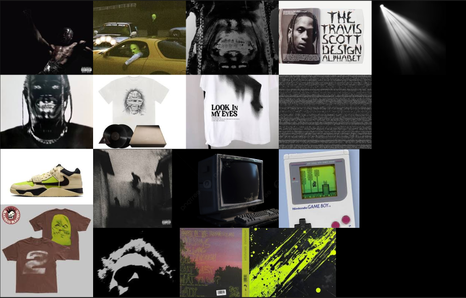
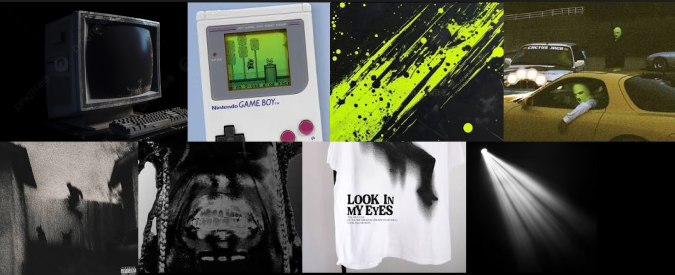

## Fait par 

- Nathan Boisleux
- Nicolas Becharat

## Concept

Notre concept symbolise un retour aux sources, une plongée dans l'esthétique brute de l'enfance à New York à la fin des années 90. On mélange la vibe sombre de Travis Scott avec l'interface nostalgique de Windows XP revisitée en mode "Utopia" (album de Travis Scott) et acide/vert que l'on retrouve souvent dans sa DA et à l'époque sur les vieux écran de PC/Gameboy. L'idée est de retrouver cette vieille énergie créative, comme à l'époque.

## Moodboard

### Version 1


### Version 2


## Lancer le projet

Dans un terminal, dans le dossier du projet :

```bash
npm i
npm run dev
```
ou
```bash
bun i
bun dev
```